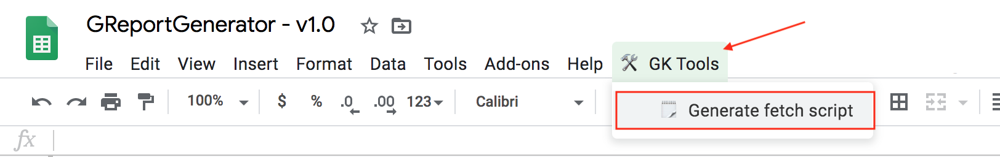
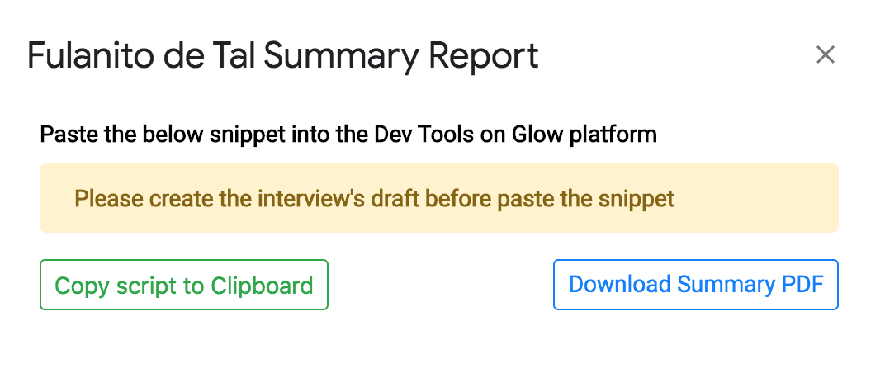
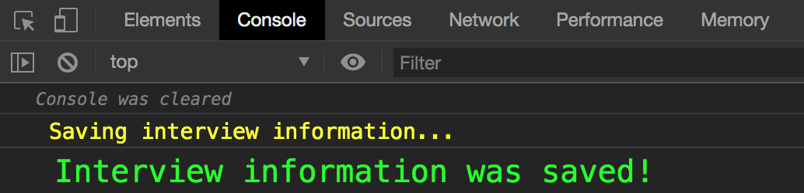
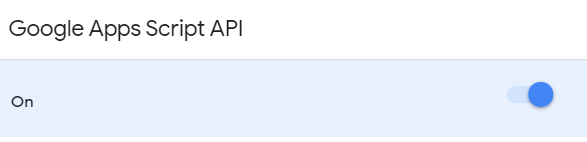

# Google Report Generator

A tool to generate a Gatekeeper report according to the interview's values.
This script just working with the Spreadsheet called [GReportGenerator]

## Usage as a Gatekeeper

1. Clone the Spreadsheet [GReportGenerator]. 
2. Please if you don't have access make a request for them.
3. Use it and fill it in your interview
4. Create the `fetch script` by doing click in the main menu option `GK Tools > Generate fetch script`

    

5. Copy the fetch script code by doing click to the button `Copy script to Clipboard`. Also, you can click in `Download the sumary PDF` button and download the file to upload it to Glow platform later.

    

6. Open DevTools on the Glow platform tab (or window) you have open
7. Paste the code and execute it in DevTools console (*See below notes*)
8. You should get a message with the text `Interview information was saved!`

    

### NOTES

You need to save a draft in Glow Platform **BEFORE** use the generated `fetch script` in the DevTools console.

## Usage as a developer or contributor

This tools was made with Google App Script by using [Google Clasp](https://github.com/google/clasp/).

### How to start with yout contribuition

1. Clone the repo

    ```bash
    git clone https://github
    ```

2. Create a new branch

    ```bash
    git checkout -b branch-name
    ```

3. Install dependencies by using npm

    ```bash
    npm i
    ```

4. Make a copy to [GReportGenerator] spreadsheet.
If you want to modify the [Summary PDF template] you should do a copy of that file as well. Please put those copied files into the folder [OnDev] located in the same path of the templates.

1. Get the scriptId from the spreadsheet you copy and update the **scriptId** on `.clasp.json` file.
    
    - In the spreadsheet Tools &rarr; Script Editor
    - In the Script editor &rarr; File &rarr; Project Properties

2. Login using **Google Credentials** with clasp

    ```bash
    npm run login
    ```

3. Enable [Google Apps Script API](https://script.google.com/home/usersettings)

    

4. Push the code to the current clasp scriptId

    ```bash
    npm run push
    ```

5.  Push the Code and watch for changes

    ```bash
    npm run push:watch
    ```

## Get Project ID to list Available APIs

- Access Google [Cloud Resource Manager](https://console.cloud.google.com/cloud-resource-manager)
- Select your Project and click the three dots to access **settings**
- Get Project ID from there
- Enable the API you need with `npm run enable <api from list>`

## External links

- [Best Practices](https://developers.google.com/apps-script/guides/html/best-practices)
- [Logging console](https://script.google.com/home/executions)

## Special Thanks

This repository is based on [Report Generator].
